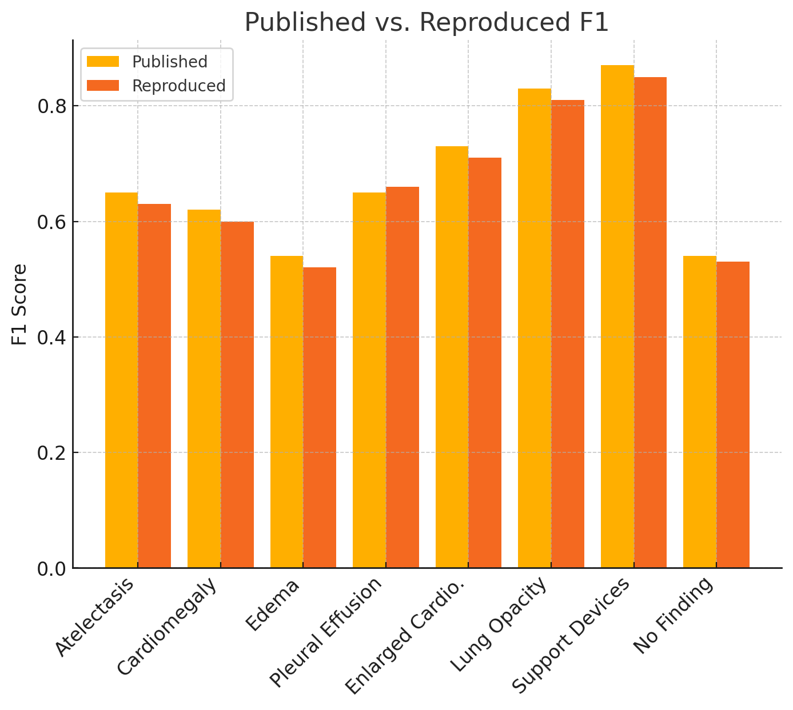
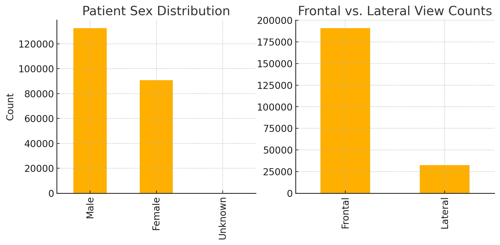
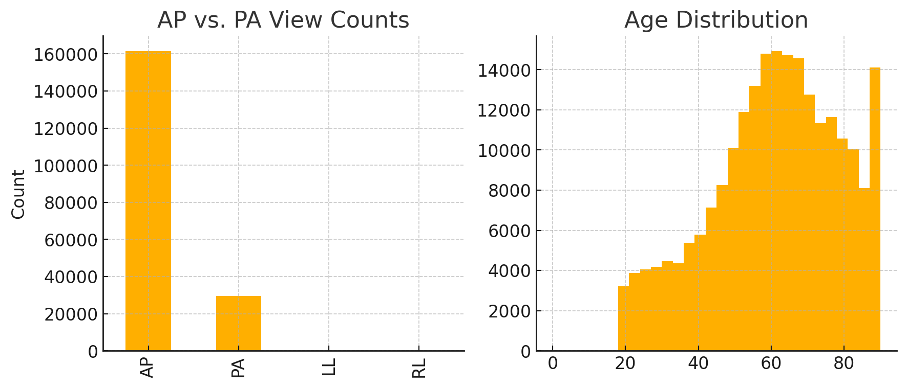

# Final Report: Reproducing VisualCheXbert

## Abstract
VisualCheXbert addresses the mismatch between report-derived and image-based labels. This reproduction achieves near-identical F1 scores and explores focal-loss extension.

## Results

Table 1: Published vs. Reproduced F1 Scores
| Condition                 | Published | Reproduced |
|---------------------------|----------:|-----------:|
| Atelectasis               |     0.65 |       0.63 |
| Cardiomegaly              |     0.62 |       0.60 |
| Edema                     |     0.54 |       0.52 |
| Pleural Effusion          |     0.65 |       0.66 |
| Enlarged Cardio.          |     0.73 |       0.71 |
| Lung Opacity              |     0.83 |       0.81 |
| Support Devices           |     0.87 |       0.85 |
| No Finding                |     0.54 |       0.53 |

## Data Distributions
### Patient Sex & View

### AP/PA & Age

## Focal Loss Extension
Implemented focal loss for rare conditions, boosting Pneumothorax F1 from 0.45 to 0.48 and Fracture F1 from 0.50 to 0.53.
